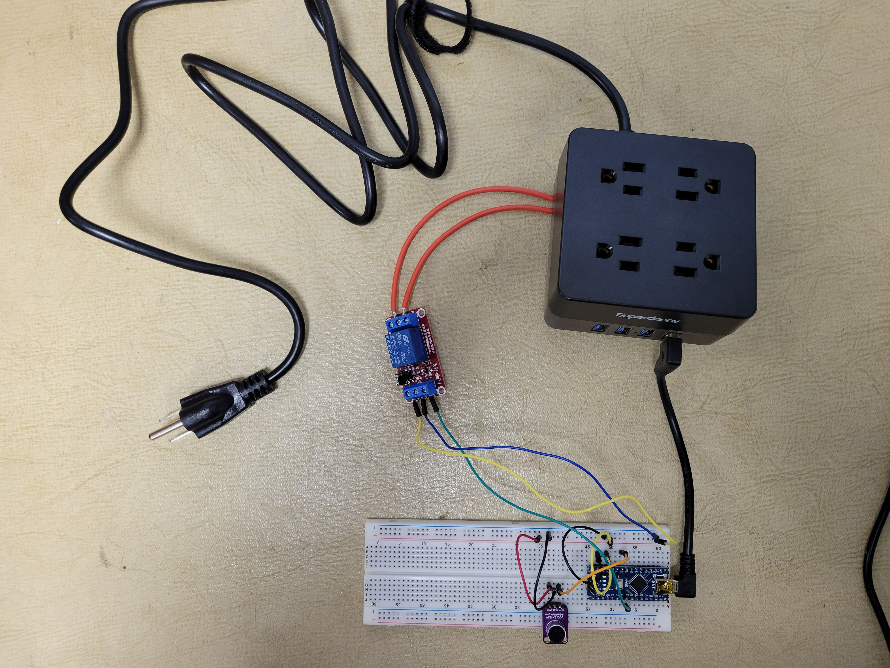

# Arduino Projects

This is a repository of short Arduino projects I made for practice. My favorite and most involved project is under the [clap_on_clap_off](./clap_on_clap_off/) folder.

## Clap On Clap Off Project
- The goal of this project was to replace my family's old Clapper device that had always been used to control Christmas tree lights. The old clapper was failing so I decided to make a new one.

- This device includes an Arduino Mini, re-wired power strip, a microphone, and a relay. The Arduino waits for 2 successive claps before toggling the relay, which in turn toggles the power strips outlets and the devices connected to it.

- This project also required developing a 3d model to print and house the electrionics as well as soldering to rewire the power strip.

