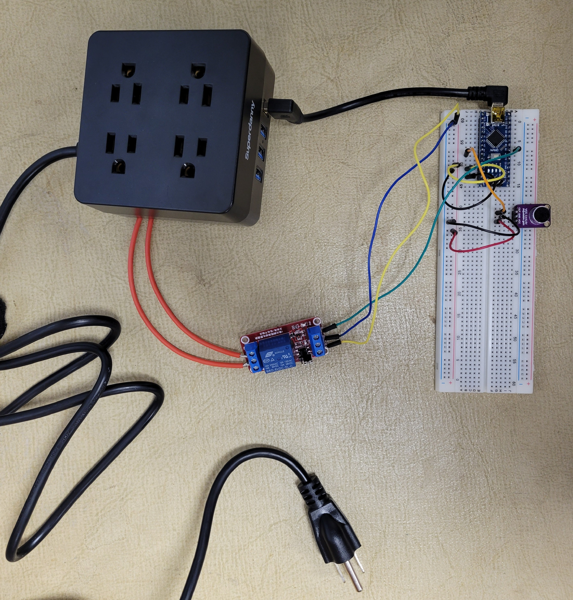

# Arduino Projects

This is a repository of short Arduino projects I made for practice.

## Table of Contents
- [Clap On Clap Off Project](#clap-on-clap-off-project)
  - [Summary](#summary)
  - [Parts List](#parts-list)
  - [Circuit Diagram](#circuit-diagram)
  - [3D Model and Housing](#3d-model-and-housing)
  - [Challenges and Learnings](#challenges-and-learnings)
  - [Potential Improvements](#potential-improvements)

## Clap On Clap Off Project

### Summary

- The code can be found here: [clap_on_clap_off.ino](./clap_on_clap_off/clap_on_clap_off.ino)

- The goal of this project was to replace my family's old Clapper device that had always been used to control Christmas tree lights. The old clapper was failing so I decided to make a new one.

- The Arduino waits for 2 successive claps before toggling the relay, which in turn toggles the power strip outlets and the devices connected to it.

- This project also required developing a 3d model to print and house the electronics as well as soldering to rewire the power strip.

### Parts List
- Arduino Nano
- power strip
- relay (SONGLE SRD-5VDC-SL-C)
- microphone sensor (MAX4466)
- 3D printed enclosure
- wiring

### Circuit Diagram

### 3D Model and Housing
File Locations: [solidworks](./clap_on_clap_off/Models/clapper_case.SLDPRT), [stl](./clap_on_clap_off/Models/clapper_case.STL)

Images:

### Results

### Challenges and Learnings
- Adjusting the sensor gain, sensitivity values, and requiring multiple claps to prevent false positives negatives
- Wiring higher voltage circuits

### Potential Improvements
- Adding sensitivity control inputs for users
- Adding other forms of control besides audible cues